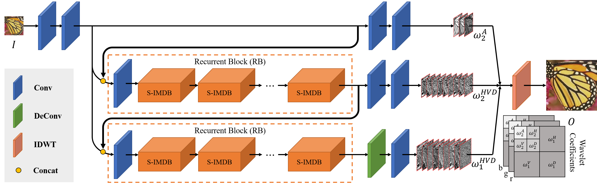
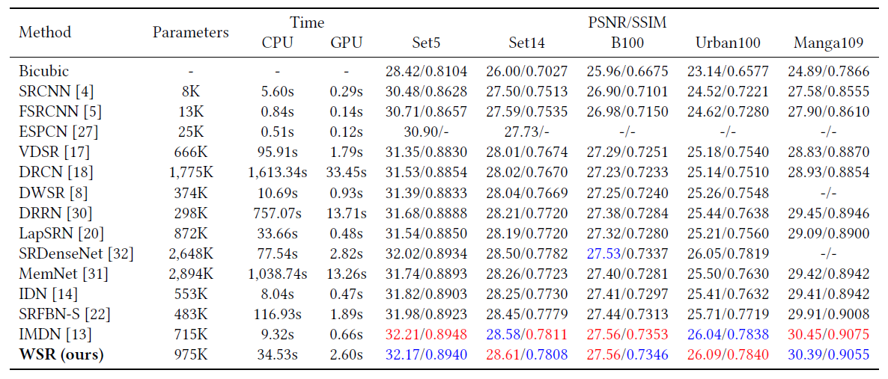
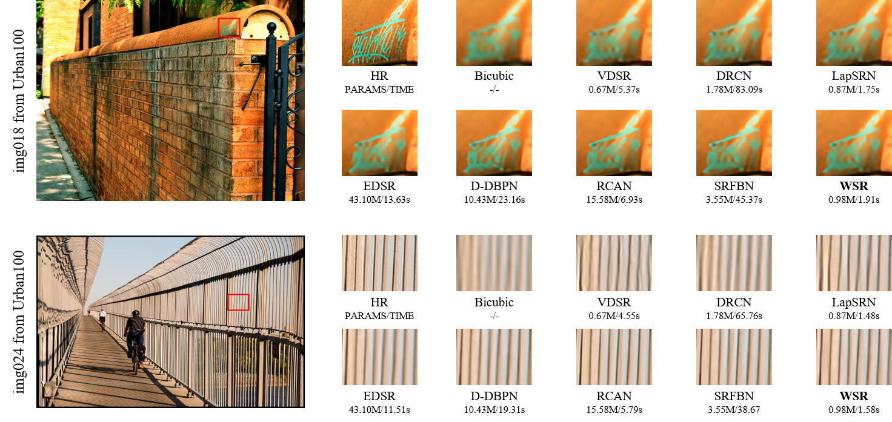
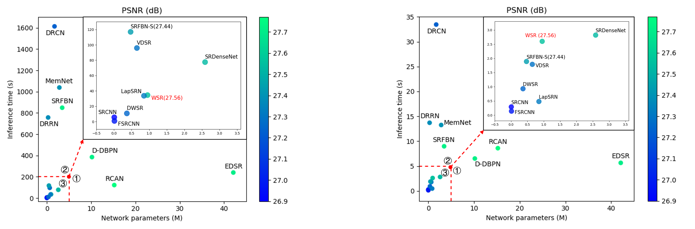

# Towards Lighter and Faster: Learning Wavelets Progressively for Image Super-Resolution (accepted by ACMMM2020)

This repository is the official PyTorch implementation for our proposed WSR.
The code is developed by [supercaoO (Huanrong Zhang)](https://github.com/supercaoO) based on [SRFBN_CVPR19](https://github.com/Paper99/SRFBN_CVPR19).
In the future, the update will be released in [supercaoO/WSR](https://github.com/supercaoO/WSR) first.


## Introduction

We propose a lightweight and fast network to learn wavelet coefficients progressively for single image super-resolution (WSR).
More specifically, the network comprises two main branches.
One is used for predicting the second level low-frequency wavelet coefficients,
and the other one is designed in a recurrent way for predicting the rest wavelet coefficients at first and second levels.
Finally, an inverse wavelet transformation is adopted to reconstruct the SR images from these coefficients.
In addition, we propose a deformable convolution kernel (side window) to construct the side-information multi-distillation block (S-IMDB),
which is the basic unit of the recurrent blocks (RBs).
Moreover, we train WSR with loss constraints at wavelet and spatial domains.



The RNN-based framework of our proposed 4× WSR.
Notice that two recurrent blocks (RBs) share the same set of weights.
The details about our proposed S-IMDB can be found in [our main paper (waiting for release)]().

If you find our work useful in your research or publications, please consider citing:

```latex
@inproceedings{zhang2020wsr,
    author = {Zhang, Huanrong and Zhi, Jin and Tan, Xiaojun and Li, Xiying},
    title = {Towards Lighter and Faster: Learning Wavelets Progressively for Image Super-Resolution},
    booktitle = {Proceedings of the 28th ACM International Conference on Multimedia (ACM MM)},
    year= {2020}
}
```


## Contents
1. [Requirements](#Requirements)
2. [Test](#test)
3. [Train](#train)
4. [Results](#results)
5. [Acknowledgements](#acknowledgements)

## Requirements
- cuda & cudnn
- Python 3
- [PyTorch >= 1.0.0](https://pytorch.org/)
- [pytorch_wavelets](https://github.com/fbcotter/pytorch_wavelets)
- tqdm
- cv2
- pandas
- skimage
- scipy = 1.0.0
- Matlab

## Test

#### Quick start

1. Clone this repository and cd to `WSR`:

   ```shell
   git clone https://github.com/FVL2020/WSR.git
   cd WSR
   ```

2. Check if the pre-trained model `WSR_x4_BI.pth` exists in `./models`.

3. Then, run following commands for evaluation on *Set5*:

   ```shell
   CUDA_VISIBLE_DEVICES=0 python test.py -opt options/test/test_WSR_Set5.json
   ```

4. Finally, PSNR/SSIM values for *Set5* are shown on your terminal, you can find the reconstruction images in `./results/SR/BI`.

#### Test on standard SR benchmark

1. If you have cloned this repository, you can first download SR benchmark (Set5, Set14, B100, Urban100 and Manga109) from [GoogleDrive](https://drive.google.com/file/d/1fC0AeoCLK8Oo3utnVa3E_r_45sJla4d1/view) (provided by [SRFBN_CVPR19]((https://github.com/Paper99/SRFBN_CVPR19))) or [BaiduYun](https://pan.baidu.com/s/19-RNNv9sr4MDdrWvsR4_4Q) (code: p9pf).

2. Run `./results/Prepare_TestData_HR_LR.m` in Matlab to generate HR/LR images with BI degradation model.

3. Edit `./options/test/test_WSR_x4_BI.json` for your needs according to [`./options/test/README.md`.](./options/test/README.md)

4. Then, run command:
   ```shell
   cd WSR
   CUDA_VISIBLE_DEVICES=0 python test.py -opt options/test/test_WSR_x4_BI.json
   ```

5. Finally, PSNR/SSIM values are shown on your terminal, you can find the reconstruction images in `./results/SR/BI`. You can further evaluate SR results using `./results/Evaluate_PSNR_SSIM.m`.

#### Test on your own images

1. If you have cloned this repository, you can first place your own images to `./results/LR/MyImage`.

2. Edit `./options/test/test_WSR_own.json` for your needs according to [`./options/test/README.md`.](./options/test/README.md)

3. Then, run command:
   ```shell
   cd WSR
   CUDA_VISIBLE_DEVICES=0 python test.py -opt options/test/test_WSR_own.json
   ```

4. Finally, you can find the reconstruction images in `./results/SR/MyImage`.

## Train

1. Download training set DIV2K from [official link](https://data.vision.ee.ethz.ch/cvl/DIV2K/) or [BaiduYun](https://pan.baidu.com/s/1dN5HIFgNKXQHQoe9ypX0jQ) (code: m84q).

2. Run `./scripts/Prepare_TrainData_HR_LR.m` in Matlab to generate HR/LR training pairs with BI degradation model and corresponding scale factor.

3. Run `./results/Prepare_TestData_HR_LR.m` in Matlab to generate HR/LR test images with BI degradation model and corresponding scale factor, and choose one of SR benchmark for evaluation during training.

4. Edit `./options/train/train_WSR.json` for your needs according to [`./options/train/README.md`.](./options/train/README.md)

5. Then, run command:
   ```shell
   cd WSR
   CUDA_VISIBLE_DEVICES=0 python train.py -opt options/train/train_WSR.json
   ```

6. You can monitor the training process in `./experiments`.

7. Finally, you can follow the [**Test Instructions**](#test) to evaluate your model.

## Results

The inference time is measured on B100 dataset (100 images) using Intel(R) Xeon(R) Silver
4210 CPU @ 2.20GHz (CPU time) and NVIDIA TITAN RTX GPU (GPU time). 

#### Quantitative Results


Comparisons on the number of network parameters, inference time, and PSNR/SSIM of different 4× SR methods. Best and second best
PSNR/SSIM results are marked in red and blue, respectively.


Comparisons on the number of network parameters and inference time of different 4× SR methods. Best results are
highlighted. Notice that the compared methods achieve better PSNR/SSIM results than our WSR does.

#### Qualitative Results


Visual comparisons with different 4× SR advances on “img018” and “img024” from Urban100 dataset. The inference time is CPU time.

#### Trade-off Results


Relationship between the number of network parameters, inference time, and reconstruction performance of different
4× SR advances. The color represents PSNR achieved by different 4× networks on B100 dataset. The inference time in left figure is CPU time and that in right figure is GPU time.

## TODO

- Option files for more scale (*i.e.*, 2×, 8×, 16×).

## Acknowledgements

- Thank [Paper99](https://github.com/Paper99). Our code structure is derived from his repository [SRFBN_CVPR19](https://github.com/Paper99/SRFBN_CVPR19). 
